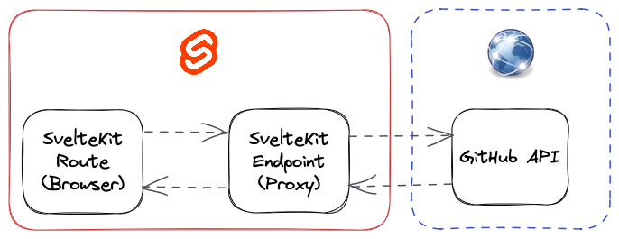

<div>
  <h1 align="center">
    Bounties
  </h1>
  <h4 align="center">
    🎯 Open-Source Projects Feed to easily search on an Organization set of issues, pull requests and any relevant tickets
  </h4>
</div>

## Motivation

Have a ease to deploy way to summarize available issues for collaboration
on the Open Source.

## Development

```bash
git clone git@github.com:whizzes/bounties.git
cd ./bounties

# if you dont have pnpm in your system you can install it with npm i -g pnpm
pnpm install
pnpm run dev
```

### Environment Variables

| Name              | Description                                                  |
| ----------------- | ------------------------------------------------------------ |
| `VITE_GITHUB_PAT` | GitHub [Personal Access Token][1] used to fetch GitHub's API |

[1]: https://docs.github.com/en/authentication/keeping-your-account-and-data-secure/creating-a-personal-access-token

### Architecture

<div align="center">
  
</div>

## License

Licensed under the MIT License
